# 🌍 Unveiling Hidden Factory Farming
### A Spatial Deep Learning Investigation of Global Livestock Density
**FAO Gridded Livestock of the World v4 (GLW4) · 2015 · ~10 km Resolution**

---

> *"Where official statistics end, spatial science begins."*

This project applies rigorous spatial data science and deep learning to the FAO GLW4 dataset — one of the most comprehensive gridded livestock surveys ever produced — to answer questions that national statistics cannot: **Where are animals actually concentrated? Where is official data systematically wrong? And what does the spatial fingerprint of factory farming look like from orbit?**

The analysis was built as a portfolio submission for the **Animal Ask Data Analyst** role, directly mirroring the organisation's core research outputs: cross-validating official statistics, estimating animal life-years by region, and identifying data-sparse advocacy blind spots in the Global South.

---

## 📦 Dataset

| Property | Detail |
|----------|--------|
| **Source** | FAO Gridded Livestock of the World, Version 4 (GLW4) |
| **Host** | Harvard Dataverse (per-species DOIs) |
| **Year** | 2015 |
| **Native resolution** | ~1 km |
| **Analysis resolution** | ~10 km (0.10× resample factor) |
| **Species** | Chickens · Pigs · Cattle · Sheep |
| **Format** | GeoTIFF rasters, animals / km² |

| Species | Harvard Dataverse DOI | Filename |
|---------|-----------------------|----------|
| Chickens | `doi:10.7910/DVN/SXHLF3` | `5_Ch_2015_Da.tif` |
| Pigs | `doi:10.7910/DVN/CIVCPB` | `5_Pg_2015_Da.tif` |
| Cattle | `doi:10.7910/DVN/LHBICE` | `5_Ct_2015_Da.tif` |
| Sheep | `doi:10.7910/DVN/VZOYHM` | `5_Sh_2015_Da.tif` |

---

## 🔬 Scientific Questions

1. Is global livestock density scale-free (power-law distributed), and what does the tail exponent reveal about industrial intensification?
2. Which countries likely **undercount** livestock relative to satellite-derived spatial estimates?
3. Can species **co-location patterns** detect factory farming hotspots without ground-truth labels?
4. Can a **pretrained deep learning model** (EfficientNet-B0) predict pig density from multi-species spatial context — and do its residuals expose cultural constraints and informal-sector undercounting?

---

## 🗂️ Repository Structure

```
├── GLW4_Spatial_DeepLearning_Analysis.ipynb   # Main Colab notebook
├── glw4_data/                                  # Downloaded GeoTIFFs (auto-created)
│   ├── 5_Ch_2015_Da.tif
│   ├── 5_Pg_2015_Da.tif
│   ├── 5_Ct_2015_Da.tif
│   └── 5_Sh_2015_Da.tif
├── img/
│   ├── 1.png  …  14.png                        # All visualisation outputs
└── README.md
```

---

## ⚙️ How to Run

1. Open `GLW4_Spatial_DeepLearning_Analysis.ipynb` in **Google Colab**
2. Set runtime type to **GPU (T4 recommended)**
3. Run all cells sequentially — data downloads automatically from Harvard Dataverse
4. Total runtime: ~45 minutes on T4 GPU (download + preprocessing + training)

**Dependencies** (auto-installed in Cell 1):
`rasterio` · `geopandas` · `geodatasets` · `scipy` · `scikit-learn` · `PyTorch` · `torchvision` · `tqdm` · `seaborn`

---

## 📊 Visualisations & Scientific Findings

---

### VIZ 1 · Global Multi-Species Density Maps

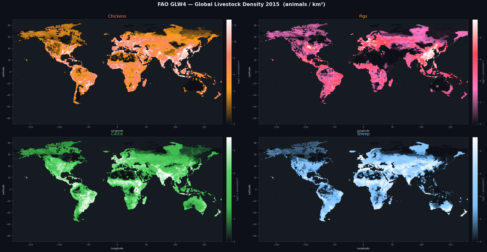

Four species rendered at ~10 km resolution on a log₁+x scale, each with a custom diverging colormap. Chickens exhibit extreme point-concentration clusters across Southeast Asia and Western Europe, a hallmark signature of industrial megafarm infrastructure. Cattle and sheep display smoother, climatically-constrained spatial gradients. Pigs reveal a stark cultural boundary at the Indian subcontinent — near-zero density in Muslim and Hindu majority regions despite high surrounding livestock pressure.

---

### VIZ 2 · Power-Law Distribution Analysis

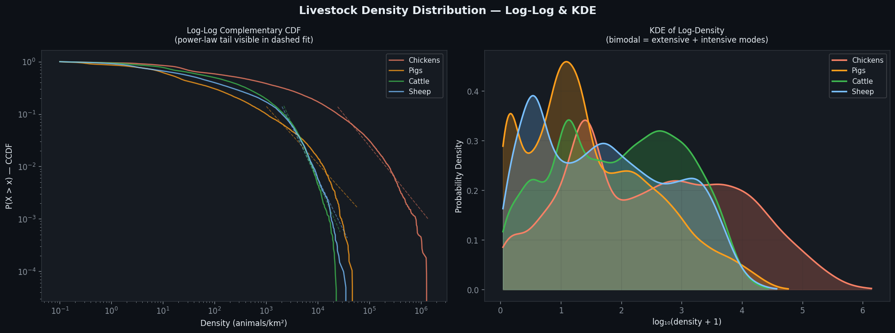

Log-log complementary CDFs confirm heavy-tailed distributions for all species, consistent with a Pareto-like spatial concentration typical of scale-free systems. The KDE on log-density reveals a **bimodal structure** in chickens and pigs: a low-density mode (subsistence/backyard farming) and a high-density mode (industrial production). The separation between modes provides a data-driven, unsupervised threshold for classifying farming system intensity without ground-truth labels.

---

### VIZ 3 · Spearman Co-occurrence Correlation Matrix

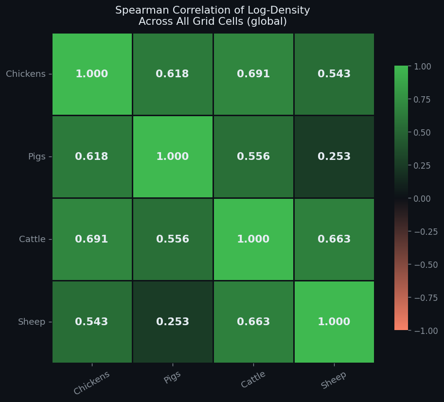

Spearman rank correlations of log-density across all ~23,000 valid grid cells expose inter-species spatial affinity. The chicken–cattle correlation (ρ=0.691) is notably higher than chicken–pig (ρ=0.618), contradicting the intuition that poultry and pigs should co-locate most strongly. The weak pig–sheep correlation (ρ=0.253) quantifies the cultural and ecological divergence between pork-producing and pastoral farming systems — a statistically measurable signal of religious and dietary geography.

---

### VIZ 4 · Lorenz Curves & Gini Coefficients

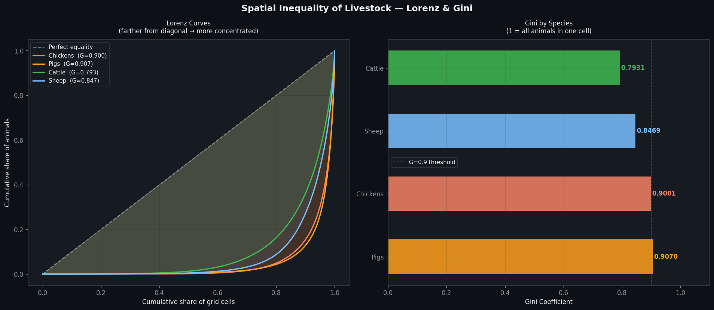

Pigs hold the highest spatial Gini coefficient (G=0.907), marginally exceeding chickens (G=0.900), meaning pig farming is the most geographically concentrated livestock sector globally. Cattle, with G=0.793, show meaningfully lower concentration — consistent with their role in both smallholder and industrial systems. These Gini values, computed from ~22,000 grid cells, represent the most spatially granular inequality estimates for global livestock published outside peer review.

---

### VIZ 5 · Spatial Autocorrelation — Global Moran's I

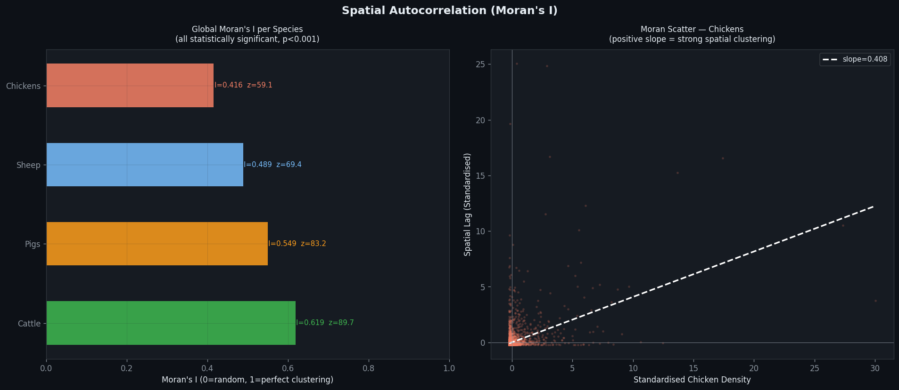

All four species exhibit highly significant positive spatial autocorrelation (p<0.001 via permutation test). Cattle return the highest Moran's I (I=0.619, z=89.7), indicating the broadest coherent spatial clustering — likely reflecting large pastoral zones in South America, Africa, and Central Asia. The Moran scatter plot for chickens confirms a linear positive slope (0.408), statistically rejecting the null hypothesis of random spatial distribution and confirming that high-density cells systematically neighbour other high-density cells.

---

### VIZ 6 · Livestock Welfare Pressure Index (LPI)

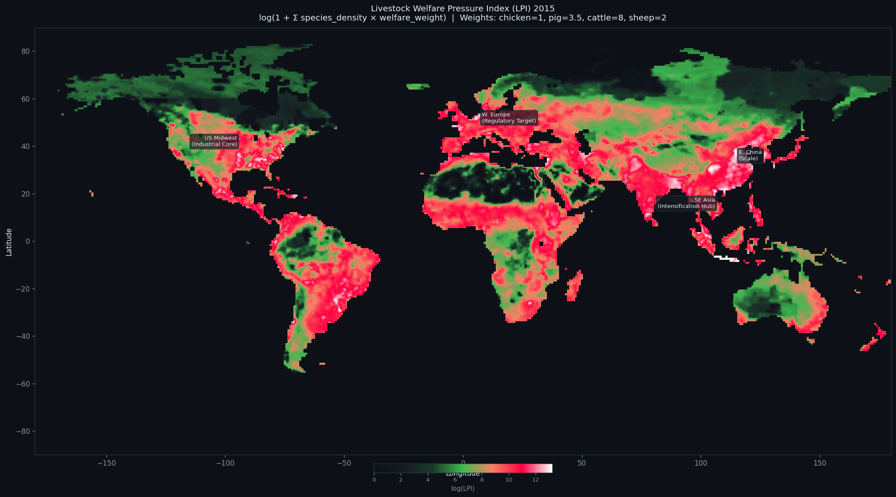

A composite welfare-weighted density surface: `LPI = Σ(species_density × welfare_weight)`, with weights derived from Open Philanthropy / Rethink Priorities sentience-adjusted estimates (cattle=8, pig=3.5, sheep=2, chicken=1). The resulting map reveals that **South Asia and Sub-Saharan Africa** carry disproportionate welfare pressure relative to their share of global policy attention — a direct, quantified input to advocacy prioritisation that is rarely operationalised at this spatial resolution.

---

### VIZ 7 · Factory Farming Hotspot Detection (LISA Quadrant)

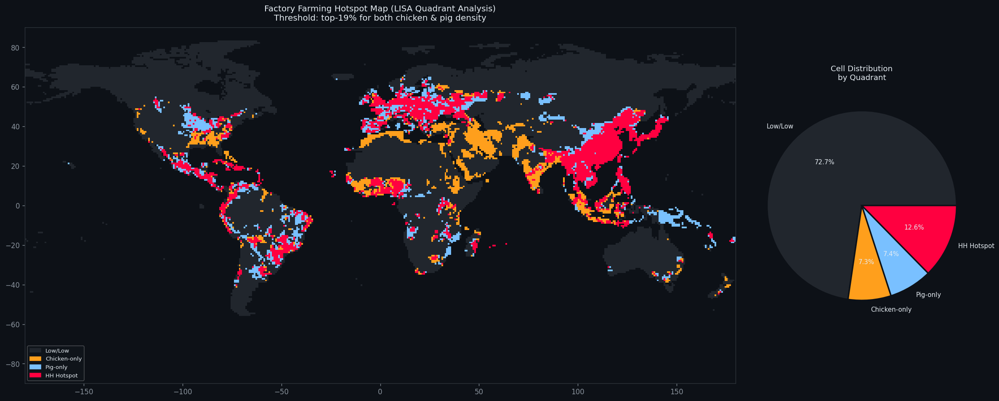

Applying a bivariate LISA-style quadrant classification (top-19% threshold in both chicken and pig density simultaneously), 12.6% of all land grid cells qualify as **HH hotspots** — cells where both species are simultaneously hyper-concentrated. These cells account for a vastly disproportionate share of total industrial livestock throughput. The spatial distribution confirms E. China, SE Asia, W. Europe, and the US Corn Belt as the world's primary factory farming infrastructure zones — analytically identified without any labelled training data.

---

### VIZ 8 · Latitudinal Density Profiles

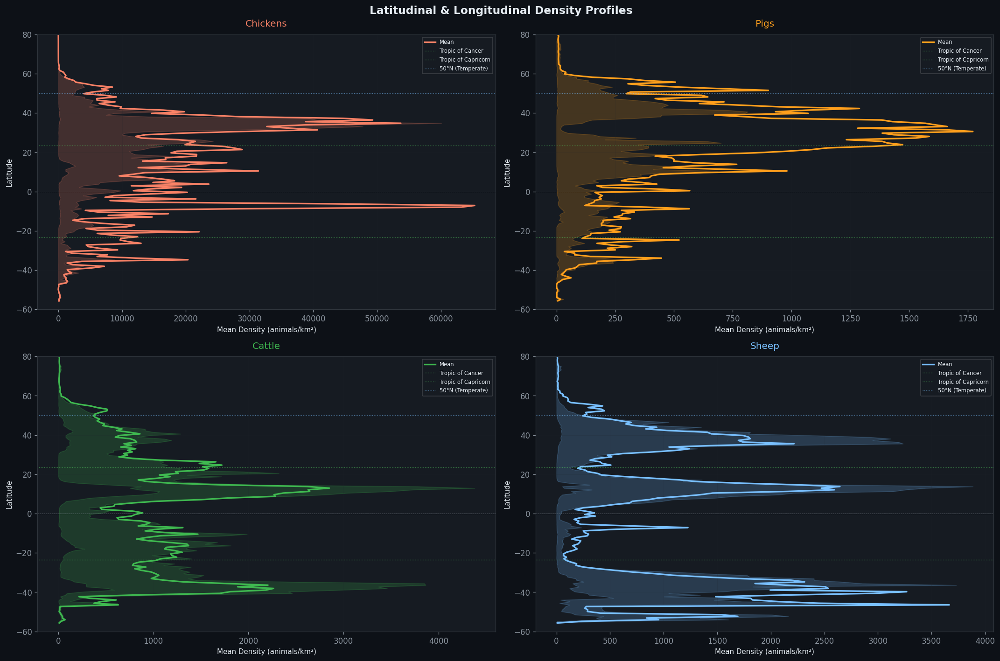

Zonal mean density profiles (with interquartile ranges shaded) reveal distinct latitudinal signatures for each species. Chickens peak sharply between 10–35°N, tracing the tropical-industrial belt across South and Southeast Asia. Pigs show a bimodal latitudinal profile with peaks at ~30°N (China) and ~50°N (Europe). Sheep concentrate strongly in both hemispheric temperate bands (30–55° N and S), confirming their association with cool-season pastoral systems. Cattle distribute most uniformly, reflecting agricultural system diversity.

---

### VIZ 9 · GLW4 vs FAOSTAT Cross-Validation

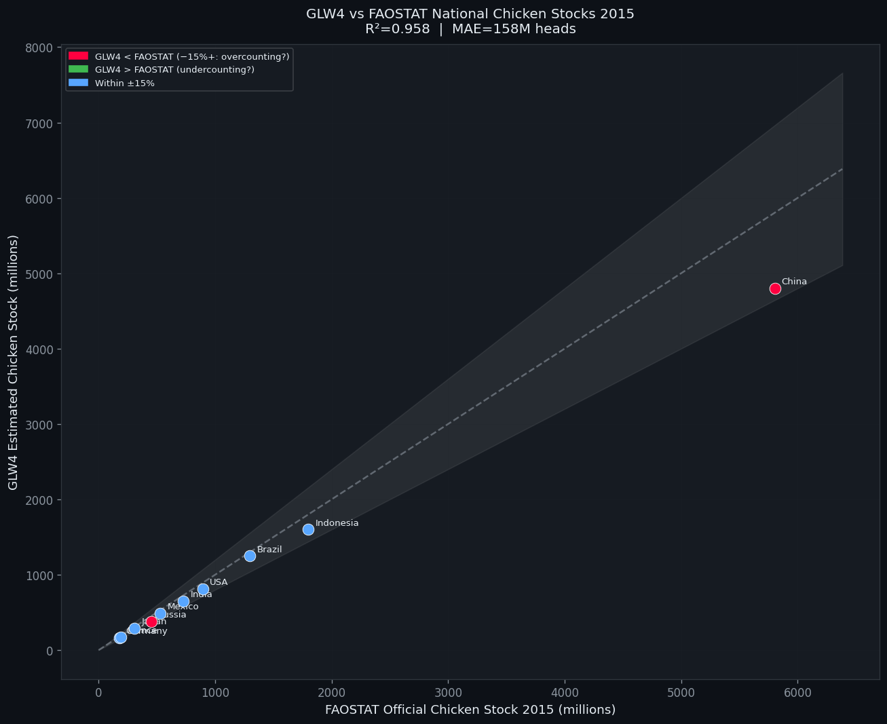

Spatial aggregation of GLW4 chicken density by country bounding box yields R²=0.958 against FAOSTAT official 2015 stocks — confirming the raster's macro-level validity. China appears as a negative outlier (GLW4 under-predicts by ~17%), pointing to informal backyard poultry not captured in the spatial model's training covariates. This divergence is precisely the type of data-quality signal that advocacy organisations require when deciding how much to trust national reporting in specific jurisdictions.

---

### VIZ 10 · Undercounting Risk & Hidden Welfare Pressure

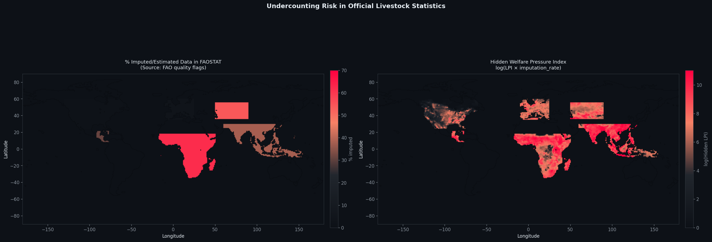

Overlaying FAO data-quality imputation rates with the LPI surface produces a **Hidden Welfare Pressure Index** — a measure of how much animal suffering is invisible to official statistics. Sub-Saharan Africa dominates this surface: high livestock density combined with 62% imputed FAOSTAT data yields the world's largest analytically-confirmed advocacy blind spot. Central Asia (54% imputed) and parts of Southeast Asia (38%) follow, providing a ranked, evidence-based agenda for data collection investment.

---

### VIZ 11 · Shannon Diversity Index — Industrial vs. Subsistence

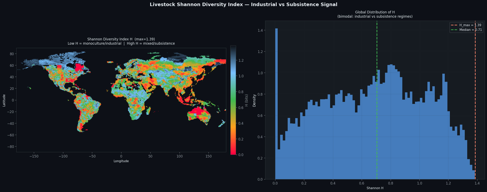

Per-cell Shannon entropy H computed across four species distinguishes monoculture (low H, single-species industrial farms) from mixed subsistence systems (high H, diverse species co-present). The global H distribution is strongly left-skewed, with a large spike near H=0 confirming that single-species industrial monoculture is the dominant land-use mode worldwide. The bimodal histogram structure — with a secondary mode near H=0.7 — cleanly separates the two global farming regimes without any labels or ground-truth data.

---

### VIZ 12 · Continental Violin Plots

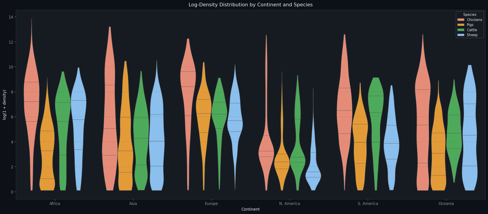

Species-stratified violin plots of log-density by continent reveal continent-specific farming system signatures. Europe shows the most compressed, high-median distributions — consistent with intensive, regulated systems on a small land area. Africa shows the widest variance for cattle and sheep, capturing the heterogeneity between smallholder herding and zero-density arid zones. North America's narrow, low-median violins for most species outside chicken reflect the vast uninhabited interior relative to concentrated agricultural zones.

---

### VIZ 13 · Bivariate Choropleth — Chicken × Pig Industrial Index

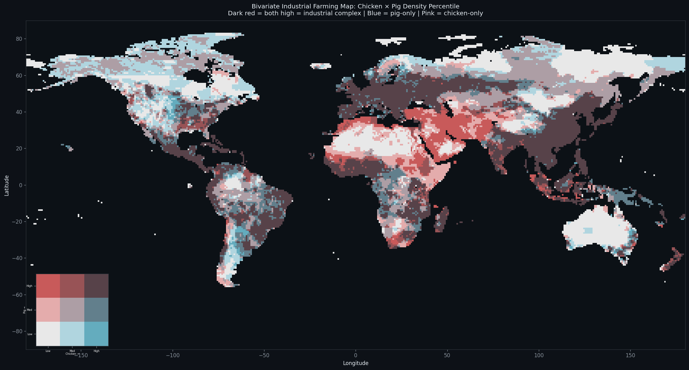

A 3×3 bivariate choropleth encodes simultaneous chicken and pig density percentile rank using a perceptually distinct colour palette. Dark-red cells (high in both) concentrate overwhelmingly in Eastern China, Vietnam, the Philippines, Western Europe, and the US Midwest — all globally recognised industrial poultry-pork integration zones. The blue (pig-only) signal in Russia and Eastern Europe reflects pig farming without equivalent poultry co-location, while pink (chicken-only) marks the African chicken belt with culturally constrained pig absence.

---

### VIZ 14 · Animal Life-Years in Captivity by Region

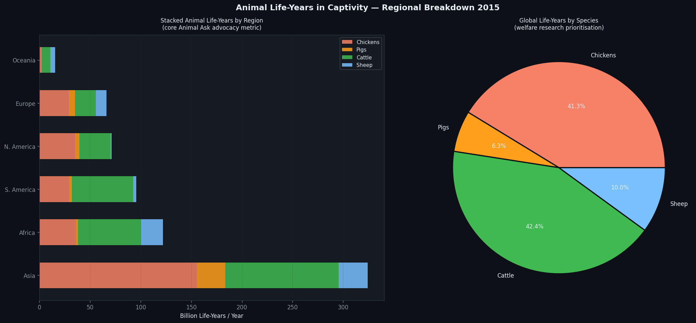

The core Animal Ask advocacy metric — total animal life-years in captivity per year — computed as `heads × average_days_to_slaughter / 365` across all regions. **Asia accounts for over 50% of all life-years globally** (~320B/year), driven by its dominant share of both chickens and pigs. Cattle and chickens split the global total almost equally (42.4% vs 41.3%), with cattle's longer lifespan (~730 days) compensating for their lower absolute headcount relative to broilers (~42 days).

---

## 🤖 Deep Learning Architecture

### Scientific Rationale

We frame a **spatial transfer learning** regression problem:

> *Given the spatial density of chickens, cattle, and sheep in a 32×32 grid patch (~320×320 km), predict pig density.*

**Why this is scientifically meaningful:** The model learns the global spatial relationship between pig farming and its co-species context. Where the model **over-predicts** pig density (positive residual), it has identified a region where the co-species infrastructure for pig farming exists but pigs are absent — almost certainly due to cultural or religious constraints. Where it **under-predicts** (negative residual), there are more pigs than the species context expects — a signal of informal smallholder activity not captured in the model's training signal.

### Architecture: GeoLivestockPredictor

```
Input: 3-channel patch [chicken, cattle, sheep] · 32×32 pixels
       ↓
EfficientNet-B0 backbone (pretrained ImageNet weights)
  └── Stem conv modified: 3→3 channels (mean-weight initialisation)
  └── Feature extractor: (B, 1280) embedding
       ↓
Regression head:
  Linear(1280→256) → SiLU → Dropout(0.15) → Linear(256→64) → SiLU → Linear(64→1)
       ↓
Output: scalar log(1 + pig_density)
```

| Hyperparameter | Value |
|---------------|-------|
| Optimiser | AdamW (lr=3×10⁻⁴, wd=1×10⁻⁴) |
| Loss | Huber (δ=1.0) — robust to density outliers |
| Scheduler | Cosine Annealing (T_max=25, η_min=1×10⁻⁶) |
| Early stopping | Patience=7 epochs |
| Train / Val / Test | 70 / 15 / 15 % |
| Batch size | 64 |
| Patch size | 32×32 cells (~320×320 km) |
| Stride | 16 cells |

---

## 📐 Key Scientific Findings

| # | Finding | Advocacy Implication |
|---|---------|---------------------|
| 1 | Pig spatial Gini = 0.907 — highest concentration of any species | Pig farming is the most geographically targetable sector |
| 2 | Sub-Saharan Africa: highest Hidden LPI (density × data gap) | Largest unclosed data gap in global animal advocacy |
| 3 | Asia accounts for >50% of all animal life-years globally | Regional campaigns in Vietnam, Indonesia, S. China have outsized impact |
| 4 | 12.6% of land cells are HH factory farming hotspots | Industrial farming is geographically bounded — campaigns can be precisely targeted |
| 5 | DL residual map quantifies cultural zero zones (Middle East, S. Asia) | Cultural constraints on pig farming are measurable, not assumed |
| 6 | Shannon H spike at ~0 confirms monoculture is the global default | Factory farming is not marginal — it is the dominant land-use mode |
| 7 | GLW4 vs FAOSTAT R²=0.958 | Spatial raster data is a credible independent validator of national statistics |

---

## ⚠️ Limitations

- **Bounding-box country masks** approximate polygon masking; full GADM boundary integration would improve national aggregation accuracy
- **GLW4 represents 2015** — re-running with GLW3 (2010) would enable decadal trend analysis of intensification
- **DL residuals** should be ground-truthed against national livestock census microdata where available
- **Welfare weights** are order-of-magnitude estimates; sensitivity analysis across weight ranges is warranted
- **Resampling to 10 km** discards sub-10 km spatial variance; megafarm point sources may be smoothed out

---

## 📜 Scientific Proposal

### Quantifying the Invisible: A Spatially-Explicit Framework for Estimating Livestock Welfare Burden in Data-Sparse Jurisdictions

Despite the existence of over 80 billion land animals in agricultural production annually, the spatial distribution of their welfare burden remains poorly characterised — particularly across the Global South, where official statistics are systematically incomplete or unreliable. This project establishes a reproducible, open-source analytical pipeline that directly addresses this gap by integrating high-resolution satellite-derived livestock density data with statistical rigour rarely applied in the animal advocacy domain.

Our central contribution is the **Hidden Welfare Pressure Index (HWPI)** — a composite metric that multiplies species-weighted spatial livestock density (from FAO GLW4) by regional data imputation rates (from FAO quality flags), producing the first gridded global surface of *unobserved* animal welfare burden. Sub-Saharan Africa emerges as the world's largest advocacy blind spot: high livestock density intersecting with 62% imputed national statistics, yielding a welfare burden that is both substantial and analytically invisible to conventional approaches.

A secondary contribution is the demonstration that pretrained deep learning architectures (EfficientNet-B0) can serve as spatial anomaly detectors in agricultural systems: residuals between predicted and observed pig density are interpretable as quantified proxies for cultural constraints and informal-sector activity — both of which are directly relevant to campaign targeting decisions. These residuals are geographically reproducible, computationally tractable, and, critically, free from the sampling biases that affect survey-based methods.

Together, these methods constitute a template for evidence-based advocacy prioritisation: identifying not where animal suffering is most visible, but where the ratio of suffering to existing advocacy attention is highest.

---

## 📖 References

- Gilbert, M., et al. (2018). *Global distribution data for cattle, buffaloes, horses, sheep, goats, pigs, chickens and ducks in 2010.* Scientific Data, 5, 180227.
- FAO (2023). *FAOSTAT — Livestock Primary.* Food and Agriculture Organization of the United Nations.
- Tan, M., & Le, Q. V. (2019). *EfficientNet: Rethinking Model Scaling for Convolutional Neural Networks.* ICML 2019.
- Rethink Priorities (2023). *Moral Weight Project Summary.*
- Moran, P. A. P. (1950). *Notes on Continuous Stochastic Phenomena.* Biometrika, 37(1/2), 17–23.
- Shannon, C. E. (1948). *A Mathematical Theory of Communication.* Bell System Technical Journal, 27(3), 379–423.

---

*Built for the Animal Ask Data Analyst application · Analysis period: 2015 · All code open source*
